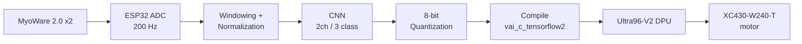
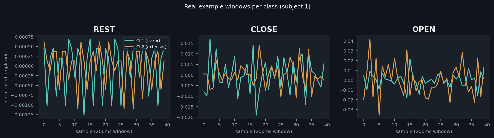
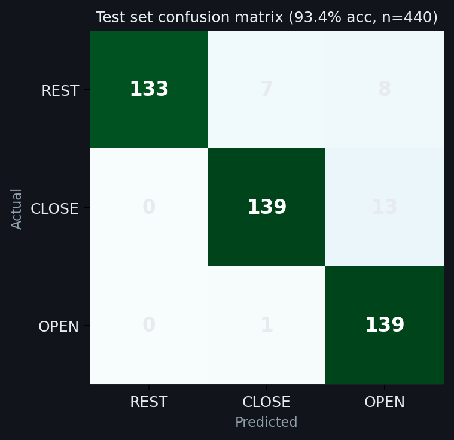
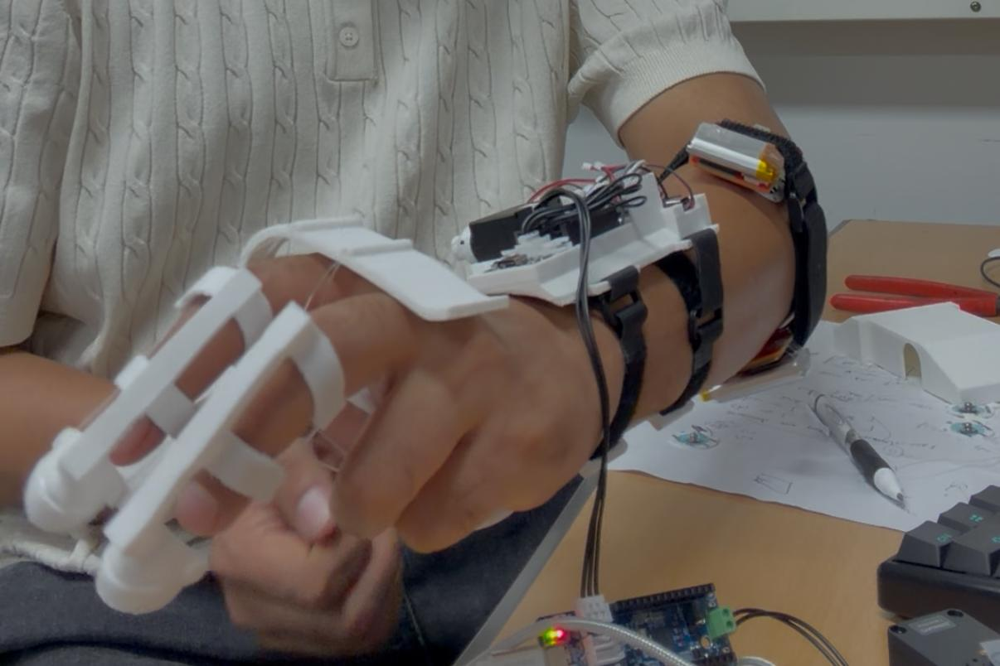

<div align="center">


# MyoWare Gesture-FPGA

**Real-time 3-class EMG gesture classification** — from a 2-channel MyoWare 2.0 muscle sensor
to an 8-bit quantized CNN running on an Ultra96-V2's DPU, driving a prosthetic-hand motor.

<p>


</p>

</div>

---

## Contents

- [Overview](#overview)
- [Results](#results)
- [Hardware](#hardware)
- [Dataset](#dataset)
- [Project structure](#project-structure)
- [Pipeline](#pipeline)
- [A real bug worth documenting](#a-real-bug-worth-documenting)
- [Roadmap](#roadmap)
- [Acknowledgments](#acknowledgments)

## Overview



This project adapts the lab's [`Gest-Infer`](../) pipeline — originally built around an 8-channel Myo armband and 7 gestures — to a cheaper, 2-channel MyoWare 2.0 sensor setup and a simpler 3-class task, reusing the same model family, the same Vitis-AI toolchain, and the same Ultra96-V2 target board.

## Results

<div align="center">

</div>

REST stays flat and quiet; CLOSE and OPEN both swing much harder — that gap is what the model actually learns to detect.

<table>
<tr>
<td width="55%" valign="top">

| Stage | Accuracy |
|---|---:|
| 3-fold cross-validation | **94.7%** |
| Held-out test (float32) | **93.6%** |
| After 8-bit quantization | **94.1%** |

4,398 labeled windows (200ms, 50% overlap), 2 subjects, evenly split across REST / CLOSE / OPEN.

</td>
<td width="45%">

</td>
</tr>
</table>

## Hardware

<table>
<tr>
<td width="50%">

| Component | Detail |
|---|---|
| 🔬 Sensor | 2× MyoWare 2.0 Muscle Sensor (flexor + extensor placement) |
| 📟 Digitizer | ESP32, 12-bit ADC, 200 Hz sampling |
| 🖥️ Target board | Avnet Ultra96-V2 |
| ⚡ DPU | `DPUCZDX8G_ISA1_B1600_0101000016010404` |
| 🦾 Actuator | Dynamixel XC430-W240-T |

</td>
<td width="50%">

<sub>The actuated hand rig this project's predictions will drive.</sub>
</td>
</tr>
</table>

## Dataset

- **Subjects:** 2
- **Classes:** `REST` (relaxed), `CLOSE` (sustained fist), `OPEN` (sustained extension) — each held for the full 5-second trial, not repeated cycling
- **Protocol:** 15 repeats × 3 gestures per subject, 5s trials, 2s inter-trial rest
- **Raw format:** `.npy` per trial, columns `[sensor_id, timestamp_us, raw_adc, label]` — see [`data/raw/Readme.txt`](data/raw/Readme.txt)

## Project structure

```
MyoWare-Gesture-FPGA/
├── data/raw/                    # Raw per-subject, per-trial recordings
├── src/
│   ├── bmis_gesture_utils.py    # Preprocessing — mirrors the lab's bmis_emg_utils.py
│   └── arch_ultra96.json        # DPU target fingerprint for compilation
├── Notebooks/
│   └── Gesture-Net.ipynb        # Train → quantize → compile, end to end
├── Pretrained_Models/
│   ├── full_models/             # Trained float32 model
│   └── ptq_models/              # Post-training-quantized (8-bit) model
├── compiled_output/
│   └── gesture_model_compiled.xmodel   # Final artifact deployed to the board
├── checkpoint/                  # Best checkpoint saved during training
└── docs/images/                 # Assets used in this README
```

## Pipeline

<details open>
<summary><strong>1. Preprocessing</strong></summary>
<br>

`src/bmis_gesture_utils.py` mirrors the lab's `bmis_emg_utils.py` function-for-function. Two deliberate departures, both forced by the different sensor hardware:
- No notch/bandpass filtering — the MyoWare sensor already filters and rectifies in hardware, unlike the Myo armband's raw output
- Each window is normalized **independently**, by subtracting its own mean and dividing by the ADC's fixed 12-bit ceiling (4095) — this is what makes the exact same normalization valid for a single live window on the FPGA, not just an offline batch

</details>

<details>
<summary><strong>2. Model</strong></summary>
<br>

`gesture_net()` in the notebook is the lab's `emg_net()` CNN, resized: 2 conv layers (32 filters), dropout 0.5, 151-unit dense layer — all unchanged. Only kernel shapes and the output layer changed, forced by 2 channels (not 8) and 3 classes (not 7).

</details>

<details>
<summary><strong>3. Quantization &amp; compilation</strong></summary>
<br>

Run inside the `xilinx/vitis-ai-tensorflow2-cpu` Docker container:
```bash
docker run --rm -v $(pwd):/workspace -w /workspace/Notebooks \
  xilinx/vitis-ai-tensorflow2-cpu:latest \
  /opt/vitis_ai/conda/envs/vitis-ai-tensorflow2/bin/jupyter notebook --ip=0.0.0.0 --allow-root
```
Then, inside the notebook: `vitis_quantize.VitisQuantizer` for 8-bit PTQ, followed by `vai_c_tensorflow2` against `src/arch_ultra96.json`.

</details>

<details>
<summary><strong>4. Deployment</strong></summary>
<br>

```bash
scp compiled_output/gesture_model_compiled.xmodel xilinx@<board-ip>:/home/xilinx/
```

</details>

## A real bug worth documenting

> **⚠️ Data leakage, found and fixed.** An early version of the normalization step divided each class's data by *that class's own* batch maximum — REST by REST's max, CLOSE by CLOSE's max, OPEN by OPEN's max. Since each class's own scale differs, this quietly leaked the class label into the normalized numbers themselves, inflating test accuracy to a misleading 97%+.
>
> **Fix:** normalize each window against a fixed, hardware-known constant instead (mirroring how the original `bmis_emg_utils.py` divides by a fixed ±127/128, since the Myo armband's raw output is always signed 8-bit) — specifically, subtract each window's own mean before scaling by the ADC ceiling. This is both leak-free and the only approach that generalizes to real-time, single-window inference on the FPGA. Honest accuracy after the fix: **94.7% CV / 93.6% test.**

## Roadmap

- [x] Data collection (3-class, 2 subjects)
- [x] Preprocessing
- [x] Training
- [x] Quantization (8-bit)
- [x] Compilation
- [x] Deployment to Ultra96-V2
- [ ] Confirm inference on real DPU hardware (VART)
- [ ] Live ESP32 → board sensor streaming
- [ ] Real-time loop: amplitude threshold gates REST; model decides CLOSE vs. OPEN
- [ ] Motor control (XC430-W240-T)

## Acknowledgments

Built on the structure and toolchain of the lab's [`Gest-Infer`](../) project (Dere et al.) — Myo armband, EEG+EMG fusion, Vitis-AI deployment on Ultra96-V2. Thanks to [MyoWare](https://myoware.com/), [Vitis-AI](https://github.com/Xilinx/Vitis-AI), and [Pyomyo](https://github.com/PerlinWarp/pyomyo).

## License

[MIT](LICENSE)
